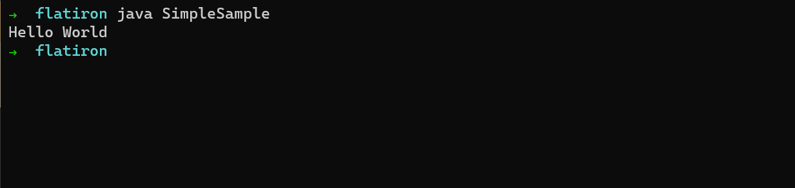

# Your First Java Program

## Learning Goals

- Run your first Java program
- Explain basic constructs

## Executing a simple Java program

- Create a folder, such as `Day1` for example 
- In this folder, create a file named `SimpleSample.java` - it's important that this file be named 
exactly as indicated here. It's one of the fundamental rules of Java. 
- Open this file with VSCode 
  - Note that when you open a `.java` file with VSCode for the first time, VSCode will ask you if you want to install 
Java-specific extension(s). Go ahead and install the suggested extension(s), but note that we will not initially use 
VSCode to compile or run our Java code (we will explain what these two terms, compile and run, mean in a later unit)
- Paste the following code in your file: 

```java
public class SimpleSample {
    public static void main(String[] args) {
        System.out.println("Hello World"); 
    }
}
```

* In your terminal, make sure you are inside your `Day1` folder
* In order to run our Java program, we first have to compile it, which we can do using the JDK command `javac <filename>`: 

````
javac SimpleSample.java 
````

* Now that the program has been compiled, we can run it using the JDK command `java <classname>`: 
````
java SimpleSample
````

- You should see the `Hello World` text in your console: 



**Explanation**

- An instruction is a command for the computer. In Java, most instructions end with a `;`. There are notable 
exceptions, and we will cover them all in detail in upcoming units. 
- A method a grouping of instructions. We use methods to organize instructions that belong together. 
  - Consider for example that you wanted to explain to someone how to make breakfast 
  - You may need to provide that person instructions on how to make toast, how to make eggs and how to make a smoothie
  - Since you still want to be able to say "make me breakfast, please", and have that person understand that 
it means "make toast", "make eggs", and "make a smoothie", you would group all those individual instructions in a single method
  - That method might be called `makeBreakfast()`
  - We will cover the exact syntax for a method and for the instructions inside that method in a later unit 
- A class is a grouping of methods. In our previous `makeBreakfast()` example, we might have a class that represents 
a chef, and that class may contain the instructions to `makeBreakfast()` as well as the instructions to `makeLunch()`
and `makeDinner()`
- Java comes with some pre-defined methods that we get to use to access existing functionality
  - For example, Java gives us pre-defined methods to print characters to the screen, perform standard math operations, 
or even send data over a network connection  
- Dot notation: access a specific method inside a specific class (we will discuss the difference between a class and
an object in a later unit)
- Example: `System.out.println()`
  - `System` is a class that comes with the JDK   
  - `out` is an object in that class 
  - `println` is a method on that object
  - The `()` allow us to pass information to the method 
- A parameter is information we pass to a method 
- In our example, we are passing the text we want to print on the screen to the `println` method
- Finally, the `;` is how most instructions end in Java

Put it all together, and you have the following line from our sample class above: 

```java
System.out.println("Hello World"); 
```

Note that there are a few more lines of code in our sample class that surround
the instruction above. We will break down what each line means in subsequent units

## Conclusion

Great job on running your first program! Over the next few lessons we'll learn more
about how the code is run and basic Java syntax.
